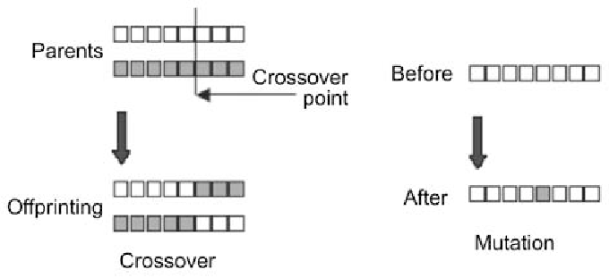
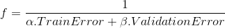

# CS7.301 Machine, Data, and Learning
## Assignment 03: Genetic Algorithms
***

### Team Members 

Team Number : 41

| S. No.| Name | Roll Number | 
| --- | --- | --- | 
| 01 | Naren Akash R J | 2018111020 | 
| 02 | P Meena Raja Sree | 2018101118 |


### Problem Statement

The 'weights` vector corresponding to an overfit model is given. Using genetic algorithm, to reduce the overfitting i.e., to generalize the model so that it performs better on unseen datasets.


The `Train`, `Validation`, and `Test` datsets were derived from the same distribution. A machine learning model was trained such that it overfits the `Train` dataset. `Validation` dataset is then used for evaluating the model. We get `train error` and `validation error` by quering the server using the `get_errors` function provided. Using genetic algorithm, we obtain the `weights` vector that generalizes well to an unseen dataset. The best vector is submitted to the server to evaluate the model using `submit` function provided. The `test error` value is used to determine the generalizability of the machine learning model.

### Genetic Algorithm

The genetic algorithm is a random-based classical evolutionaly algorithm. In order to find a better `weights` vector in our example, we apply random changes to the current vector to generate  new ones. It is based on Darwin's theory of evolution. It is a slow gradual process that works by making changes to the making slight and slow changes. Also, genetic algorithm makes slight changes to its solutions slowly until getting the best solution.

### How GA Works?

- Genetic Algorithm works on a population (here, the collection of `weights` vectors) consisting of some solutions where population size is the number of solutions. 
- Each individual solution has a chromosome. The chromosome is represented as a set of parameters (here, the set of `weights`) that defines the individual. 
- Each chromosome has a set of genes. Each gene (here, `weight`) is a decimal value representing the weight of some feature.
- Each individual has a fitness value. The higher the fitness value, the higher the quality of the solution. 
- Selection of the best individual is based on their quality. The higher quality individual has higher probability of being selected in a mating pool. 
- The individuals in the mating pool are called as `parents`. Every two parents selected from the mating pool will generate two `offsprings`.
- Some changes will be applied to each of the offspring to create new offsprings. This ensures that the offsprings just don't have only the characteristics of their parents.
- The set of all newly generated individuals will be the new population. Each population is called a `generation`. 

### Mating: Variation Operators

The higher quality individuals from the mating pool are selected as parents for mating. For every two parents selected, two variation operators are applied. 



#### Crossover 

For every two parents, crossover takes place by selecting a random point in the chromosome and exchanging genes before and after such point from its parents. The resulting chromosomes are offspring. Crossover is important and without it, the offspring will be identical to its parent.

#### Mutation

Mutation may be defined as a small random tweak in the chromosome, to get a new solution. Without mutation the offspring will have all of its properties from its parents. To add new features to such offspring, mutation took place. The individual after mutation is called mutant.

### Specifications of our GA

#### Fitness Function

Each individual solution (here, `weights` vector) is awarded a score to indicate how close it came to meeting the overall specification of the desired solution i.e., how well the model is able to generalize.



This research paper shows different types of fitness functions for normal genetic algorithm to optimize the parameters. Our fitness function also agrees to the general format of the function mentioned in the paper. 
*Roudbari, Alireza & Saghafi, Fariborz. (2014). Intelligent Modeling and Identification of Aircraft Nonlinear Flight Dynamics. Chinese Journal of Aeronautics. 27. 10.1016*

#### Crossover Function

```python
def crossover(parents, offspring_size):
    offspring = numpy.empty(offspring_size)
    crossover_point = numpy.uint8(offspring_size[1]/2)

    for k in range(offspring_size[0]):
        parent1_idx = k%parents.shape[0]
        parent2_idx = (k+1)%parents.shape[0]
        offspring[k, 0:crossover_point] = parents[parent1_idx, 0:crossover_point]
        offspring[k, crossover_point:] = parents[parent2_idx, crossover_point:]
    return offspring
```

The parents are selected in a way similar to a ring. The first with indices 0 and 1 are selected at first to produce two offspring.
#### Use of Mutations 

```python
def mutation(offspring_crossover, num_mutations=1):
    mutations_counter = numpy.uint8(offspring_crossover.shape[1] / num_mutations)
    for idx in range(offspring_crossover.shape[0]):
        gene_idx = numpy.asscalar(numpy.random.randint(0, 11, 1))
        for mutation_num in range(num_mutations):
            random_value = numpy.random.uniform(-0.5, 0.5, 1)
            offspring_crossover[idx, gene_idx] = offspring_crossover[idx, gene_idx] *  (1  + random_value)
            gene_idx = gene_idx + mutations_counter
    return offspring_crossover
```

It loops through each offspring and adds a uniformly generated random number in the range (-0.5, 0.5).


#### Hyperparameters

The values of the following parameters are based on the genetic algorithm submitted for evaluation. Several tweaks in the parameters have been made before arriving in the final values.

| Parameters | Final Value |
| --- | --- | 
| Number of Generations | 100 |
| Population Size | 16 |
| (α, β) in Fitness Function | (1, 1) | 

#### Heuristics (if any)

| Parameters | Observation(s) |
| --- | --- | 
| Number of Generations | We increase the number of generations to allow the algorithm to find a better set of parameters. But, we find that the algorithm converges at some point and there is no visible change in the vectors obtained. |
|Population Size | Initally, we had 4 as the population size. Then, because of better performance, we increased it to 8 and then to 16. |
| Disabling Crossovers | In certain cases where we the algorithm has already converged, doing only mutation has decreased the error. |
| Disabling Mutations | In the initial stages, mutations have increased the error significantly for some vectors. |
| Fitness Function | We have tried the values (1, 1), (5, 4), (3, 2) among others for the fitness function. |
| Brute-force Tweaks | We have manually added some random values to the vector (similar to mutation) and found out that they have improved the performance. We retained such vectors in the new population. |

We started with the initial vector given and obtained certain `weights` vector which reduced the overfitting of the model. We manually as well as through the function did some variations to the previous outut vectors(crossovers as well as mutations) and made them as the new population to the genetic algorithm. Meanwhile, certain parameters of the algorithms were tweaked to get a better performance. Such a process was ccontinued for several days and the final algorithm used is submitted for evaluation.

### Diagram: Genetic Algorithm Visual Explanation 

The variations - crossover and mutation (if any) for three successive iterations of genetic algorithm is shown. Please click on this link to see the pictorial explanation of the working of our genetic algorithm. 

https://drive.google.com/drive/folders/1vHZvNLEnkm_uCiFGLZ5RKfbWob42VOff?usp=sharing

### Python Program Execution 

1. Run the Genetic Algorithm code by executing the command
`python3 app.py` on the shell terminal.
2. You may redirect the output to a file for further examination.
`python3 app.py > TRACE.txt`
3. Take the final best `weights` vector and submit it to the server by adding the vector to `submit.py` file and executing the following command: `python3 submit.py`.