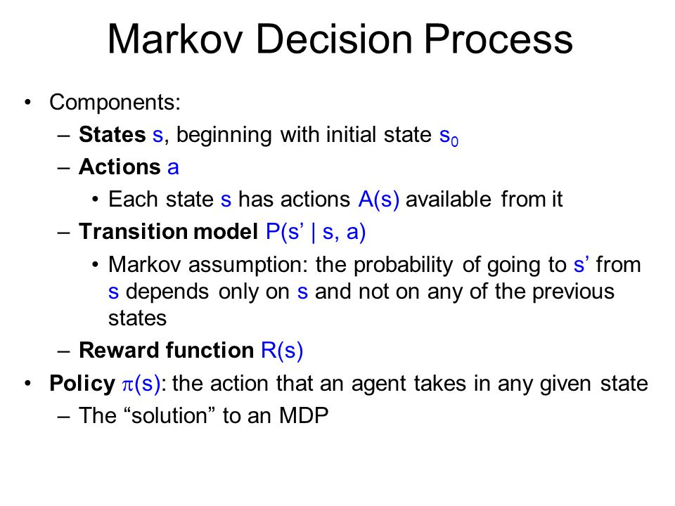
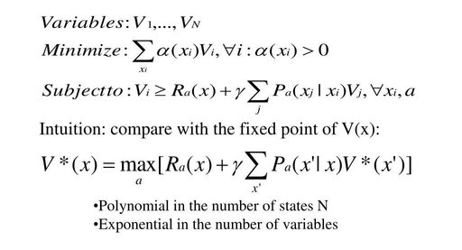

# CS7.301 Machine, Data, and Learning
# Assignment 02-C

---

### Team Members

| Name | Rolll Number |
| --- | --- |
| Naren Akash R J | 2018111020 |
| Meena Raja Sree P | 2018101118 |

Team Number: 41
International Institute of Information Technology Hyderabad

### Defining a MDP

A Markov Decision Process (MDP) model contains:

- A set of possible world states S.
- A set of Models.
- A set of possible actions A.
- A real valued reward function R(s,a).
- A policy the solution of Markov Decision Process.



### LP Formulation for Solving MDP



#### Procedure for Building the Transition Probability Matrix

Let's assume that we can move from state `a` to state `b` by an action `x`. We collect all possible (b, x) tuples. The number of such tuples become the number of columns. All possible states are taken in the columns.

- Number of rows = 60
- Number of columns = 100

Now, in the entry in row `i` and column `j` of the matrix becomes the probability of moving from state `i` to state `k` through action `x' where (k, x) is described the column j.

We take the highest value obtained for each state and its corresponding action to be included in the policy.

Note: We have already stored the complete transition probability matrix in a `dictionary` data structure. We remove invalid states and try to compress it using the above method. 

#### Procedure for Finding the Optimal Policy

After using linear programming method to solve the linear system and constraints formulated from the Markov Decision Process, we get the values for the variable vector `x`.

```python
def computeSimplex(self):
    X_vector = cp.Variable((self.num_actions, 1))
    constraints = [(self.A_matrix * X_vector) == self.alpha_vector, X_vector >= 0]
    objective = cp.Maximize(self.rewards_vector * X_vector)
    problem = cp.Problem(objective, constraints)
    problem.solve()
```

#### Multiple Policies from One Markov Decision Process

Though we get unique value for optimal value from the linear programming method, we may have one or more optimal policies. 

- The value of alpha vector - the initial state probabilites may have an impact on the optimal policy.
- Changing the reward vector may change the optimal policy.
- The order of the states and actions in our implementation also determines the optimal policy obtained. 

